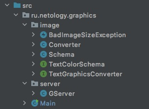

# Конвертер в текстовую графику

Курсовая работа - участие в разработке приложения, умеющего скачивать картинки по URL и конвертировать изображения в текстовую графику (т. е. текст из разных символов, которые в совокупности выглядят как изображение). Вот пример его работы (картинка на нём — это текст из мелких символов):


Часть приложения уже была написана, моей задачей была доработка его основной логической части в соответствии с требованиями. А именно: создание классов `Converter.java` и `Schema.java`.

## Структура проекта
Перед вами обычный джава-проект с несколькими папками. Нас будут интересовать .java-файлы, которые располагаются по следующим пакетам:



| Класс / Интерфейс      | Для чего?                                                                                                                  |
| ----------- |----------------------------------------------------------------------------------------------------------------------------|
| `BadImageSizeException`      | Класс выбрасываемого исключения                                                                                            |
| `TextColorSchema`   | Интерфейс цветовой схемы, реализованный мной в классе `Schema`                                                             |
| `TextGraphicsConverter`   | Интерфейс конвертера картинок, который я реализовала в классе `Converter`                                                  |
| `GServer`   | Готовый класс сервера, использующий мой конвертер                                                                          |
| `Main`   | Запуск приложения. В нём запускается сервер, также в нём можно будет конвертировать картинки в текстовые файлы без сервера |

## Требования к конвертеру

Все требования к конвертеру [описаны](src/ru/netology/graphics/image/TextGraphicsConverter.java) в интерфейсе. Самый главный метод это метод `convert`, который принимает параметром урл в виде текста (например, `"https://raw.githubusercontent.com/netology-code/java-diplom/main/pics/simple-test.png"`), внутри метода качает и анализирует картинку, после чего отдаёт значение типа `String`, в котором содержится это изображение в виде текстовой графики.

Пример работы конвертера, результат работы которого выводим в консоль:

[//]: # (```java)
        String url = "https://raw.githubusercontent.com/netology-code/java-diplom/main/pics/simple-test.png";
        String imgTxt = converter.convert(url);
        System.out.println(imgTxt);

В итоге мы видим такой результат, где более тёмные участки заменяются на более "жирные" символы, а светлые на более незаметные символы:


Также интерфейс конвертера требует от него иметь возможность вытавлять ему определённые настройки перед конвертацией:
- Можно установить максимально допустимое соотношение сторон (ширины и высоты); если метод не вызывали, то любое соотношение допустимо;
- Можно установить максимально допустимую высоту итогового изображения; если метод не вызывали, то любая высота допустима;
- Можно установить максимально допустимую ширину итогового изображения; если метод не вызывали, то любая ширина допустима;
- Можно установить текстовую цветовую схему — объект специального интерфейса, который и будет отвечать за превращение степени белого (числа от 0 до 255) в символ; если метод не вызывали, то используется объект написанного класса `Schema`  как значение по умолчанию.

Например, следующий конвертер не должен конвертировать, если ширина больше длины в три раза, тк максимальное соотношение сторон ему выставлено в 2:
```java
        TextGraphicsConverter converter = ...; // Создайте тут объект вашего класса конвертера
	converter.setMaxRatio(2);  // выставляет максимально допустимое соотрношение сторон картинки
	String imgTxt = converter.convert(...); // для слишком широкой картинки должно выброситься исключение BadImageSizeException.
```

Общая схема работы метода `convert` будет соответствовать следующей последовательности действий:
1. Скачиваем картинку по URL;
2. Менеджеру могли выставить максимально допустимое соотношение сторон (ширины и высоты); если оно слишком большое, то конвертация не делается и выбрасывается исключение;
3. При конвертации мы будем менять каждый пиксель на символ: чем пиксель темнее, тем «жирнее» символ, который мы подставим. Менеджеру могли выставить максимальные ширину и высоту итоговой картинки, при этом если исходная картинка больше, то нам надо уменьшить её размер, соблюдая пропорции;
4. Превращаем цветное изображение в чёрно-белое (чтобы мы смотрели только на интенсивность цвета, а не подбирали для красного одни символы, для зелёного другие и т. п);
1. Перебираем все пиксели изображения, спрашивая у них степень белого (число от 0 до 255, где 0 — это чёрный, а 255 — это светлый). В зависимости от этого числа выбираем символ из заранее подготовленного набора;
1. Собираем все полученные символы в единую строку, отдаём как результат конвертации.


## Требования к цветовой схеме
Интерфейс конвертера написан так, чтобы сам он не подбирал каждому цвету определённый символ, но чтобы им занимался другой объект следующего интерфейса:
```java
public interface TextColorSchema {
    char convert(int color);
}
```

Логика его работы: 

Вот список символов от самых «тёмных» к самым «светлым»: '●', '◍', '◎', '○', '☉', '◌', '+', '-', ':' . В зависимости от переданного значения интенсивности белого выбирается соответствующий текстовый символ.

## Запуск программы
В класс `Main` заполнена переменная для конвертера объектом класса `Converter`, чтобы он был передан серверу. Теперь, после старта метода `main` будет запущен сервер на строке `server.start()`. Сервер будет писать о происходящем в консоль. Если ему удалось успешно стартовать, то страница приложения будет доступна по локальному для вашего компьютера адресу http://localhost:8888/ .

Для конвертации достаточно вставить в форму прямую ссылку на картинку и нажать `Convert`. Перед вами будет изображение, выполненное текстовой графикой. Если конвертер не сможет сконвертировать, то в консоли будет стек-трейс исключения, однако сервер при этом не упадёт, а продолжит свою работу (на веб-странице же будет сообщение о том, что конвертация не удалась).

Для тестирования можете использовать урл следующих изображений:
* Простое маленькое изображение для отладки: `https://raw.githubusercontent.com/netology-code/java-diplom/main/pics/simple-test.png`
* Другое изображение для демонстрации: `https://i.ibb.co/6DYM05G/edu0.jpg`
